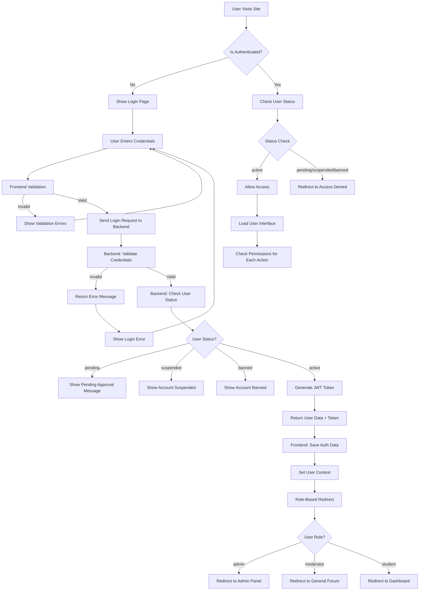
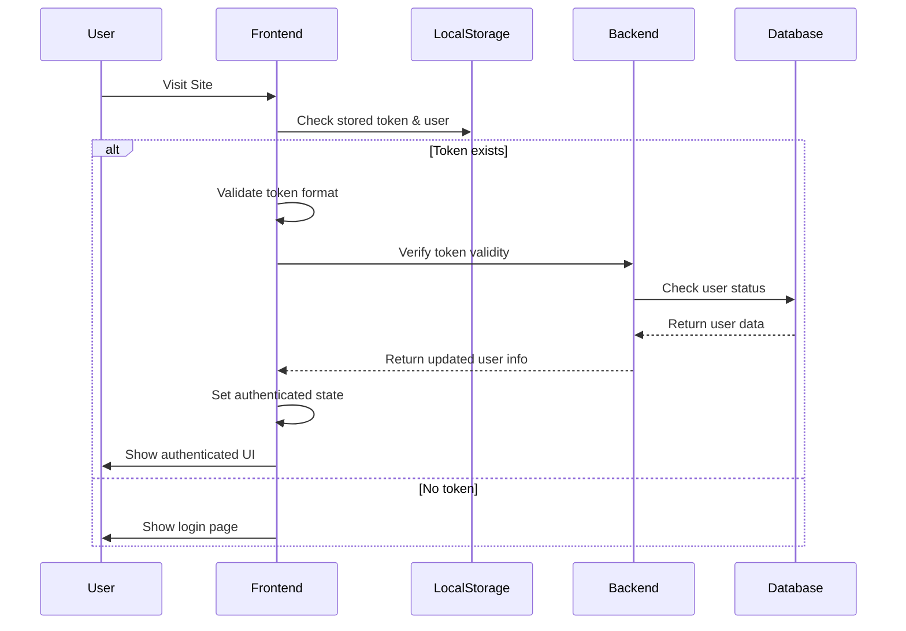
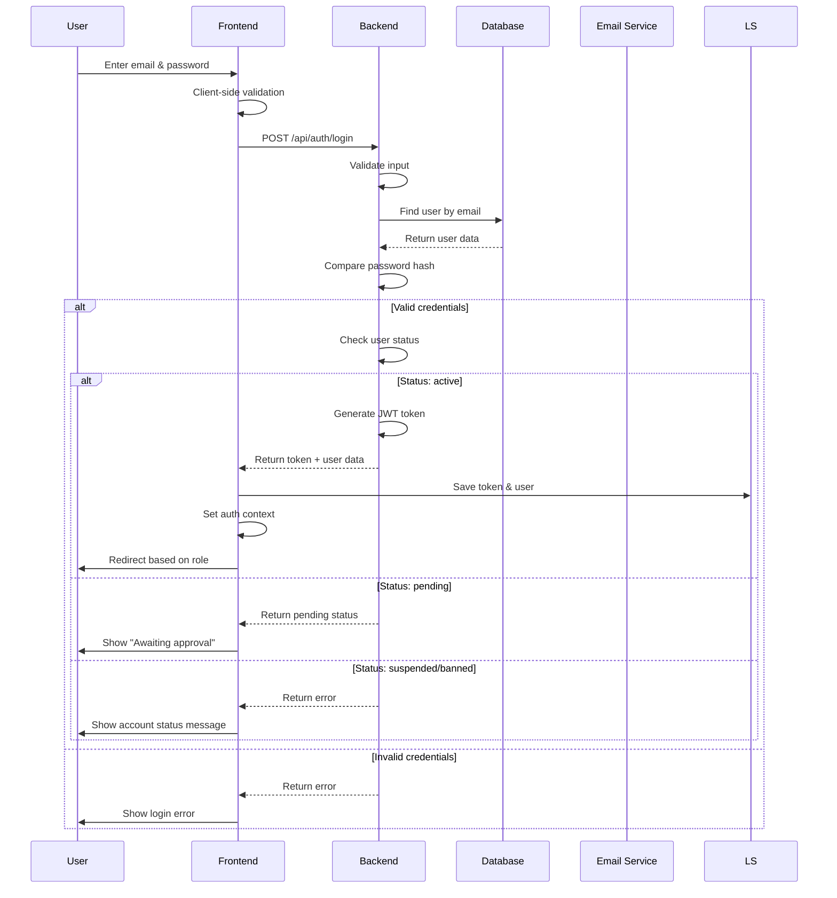
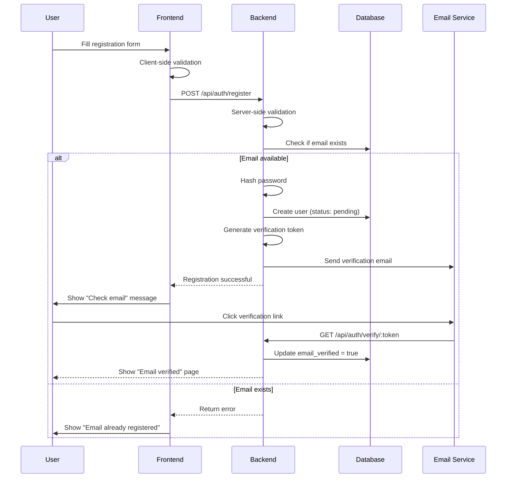
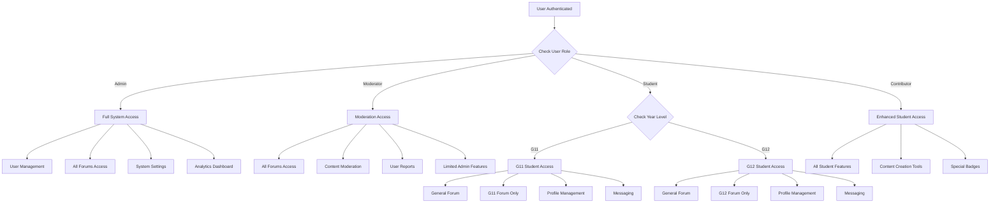

# School Forum System - Login & Authentication Flow 🔐

## Complete Authentication Flow Diagram



## Detailed Authentication States

### 1. Initial Load Flow


### 2. Login Process Flow


### 3. Registration Flow


### 4. Role-Based Access Control


## Authentication Components Architecture

### Frontend Components
```
src/
├── contexts/
│   └── AuthContext.js          # Global auth state management
├── components/
│   └── Auth/
│       ├── ProtectedRoute.js   # Route protection wrapper
│       └── LoginForm.js        # Login form component
├── pages/
│   ├── Login.js               # Login page
│   ├── Register.js            # Registration page
│   ├── VerifyEmail.js         # Email verification
│   ├── ForgotPassword.js      # Password reset request
│   ├── ResetPassword.js       # Password reset form
│   └── AccessDenied.js        # Access denied page
└── services/
    └── api.js                 # API service layer
```

### Backend Routes
```
backend/src/routes/
└── auth.js
    ├── POST /register         # User registration
    ├── POST /login           # User login
    ├── POST /logout          # User logout
    ├── GET /verify/:token    # Email verification
    ├── POST /forgot-password # Password reset request
    ├── POST /reset-password  # Password reset
    ├── GET /me              # Get current user
    └── PUT /update-profile  # Update user profile
```

## User Status States

### Status Definitions
```javascript
const USER_STATUSES = {
  pending: {
    description: "Awaiting admin approval",
    canLogin: true,
    canAccessForums: false,
    canPost: false,
    message: "Your account is pending approval. Please wait for admin verification."
  },
  active: {
    description: "Full access granted",
    canLogin: true,
    canAccessForums: true,
    canPost: true,
    message: "Welcome! You have full access to the forum."
  },
  suspended: {
    description: "Temporarily suspended",
    canLogin: true,
    canAccessForums: false,
    canPost: false,
    message: "Your account has been temporarily suspended. Contact admin for details."
  },
  banned: {
    description: "Permanently banned",
    canLogin: false,
    canAccessForums: false,
    canPost: false,
    message: "Your account has been banned. Contact admin if you believe this is an error."
  }
};
```

### Role Hierarchy
```javascript
const ROLE_HIERARCHY = {
  admin: {
    level: 4,
    permissions: ["*"], // All permissions
    canAccess: ["admin", "all_forums", "user_management", "system_settings"]
  },
  moderator: {
    level: 3,
    permissions: ["moderate", "access_all_forums", "manage_content"],
    canAccess: ["all_forums", "moderation_tools", "user_reports"]
  },
  contributor: {
    level: 2,
    permissions: ["enhanced_posting", "special_features"],
    canAccess: ["grade_forum", "general_forum", "contributor_tools"]
  },
  student: {
    level: 1,
    permissions: ["basic_posting", "messaging"],
    canAccess: ["grade_forum", "general_forum", "profile"]
  }
};
```

## Security Features

### JWT Token Management
```javascript
// Token structure
{
  "userId": 123,
  "email": "user@school.edu",
  "role": "student",
  "status": "active",
  "iat": 1640995200,
  "exp": 1641081600
}

// Token validation middleware
const authMiddleware = (req, res, next) => {
  const token = req.headers.authorization?.split(' ')[1];
  
  if (!token) {
    return res.status(401).json({ error: 'No token provided' });
  }
  
  try {
    const decoded = jwt.verify(token, process.env.JWT_SECRET);
    req.user = decoded;
    next();
  } catch (error) {
    return res.status(401).json({ error: 'Invalid token' });
  }
};
```

### Password Security
```javascript
// Password requirements
const PASSWORD_RULES = {
  minLength: 8,
  requireUppercase: true,
  requireLowercase: true,
  requireNumbers: true,
  requireSpecialChars: false,
  maxAttempts: 5,
  lockoutDuration: 15 * 60 * 1000 // 15 minutes
};

// Password hashing
const hashPassword = async (password) => {
  const saltRounds = parseInt(process.env.BCRYPT_ROUNDS) || 12;
  return await bcrypt.hash(password, saltRounds);
};
```

## Error Handling

### Authentication Errors
```javascript
const AUTH_ERRORS = {
  INVALID_CREDENTIALS: {
    code: 'AUTH001',
    message: 'Invalid email or password',
    status: 401
  },
  ACCOUNT_PENDING: {
    code: 'AUTH002',
    message: 'Account pending approval',
    status: 403
  },
  ACCOUNT_SUSPENDED: {
    code: 'AUTH003',
    message: 'Account temporarily suspended',
    status: 403
  },
  ACCOUNT_BANNED: {
    code: 'AUTH004',
    message: 'Account permanently banned',
    status: 403
  },
  TOKEN_EXPIRED: {
    code: 'AUTH005',
    message: 'Session expired, please login again',
    status: 401
  },
  EMAIL_NOT_VERIFIED: {
    code: 'AUTH006',
    message: 'Please verify your email address',
    status: 403
  }
};
```

## Session Management

### Frontend Session Handling
```javascript
// AuthContext session management
const AuthProvider = ({ children }) => {
  const [user, setUser] = useState(null);
  const [loading, setLoading] = useState(true);
  
  useEffect(() => {
    // Check for existing session on app load
    const initAuth = async () => {
      const token = localStorage.getItem('token');
      const userData = localStorage.getItem('user');
      
      if (token && userData) {
        try {
          // Verify token is still valid
          const response = await api.get('/auth/me');
          setUser(response.data.user);
        } catch (error) {
          // Token invalid, clear storage
          localStorage.removeItem('token');
          localStorage.removeItem('user');
        }
      }
      setLoading(false);
    };
    
    initAuth();
  }, []);
  
  const login = async (credentials) => {
    const response = await api.post('/auth/login', credentials);
    const { user, token } = response.data;
    
    localStorage.setItem('token', token);
    localStorage.setItem('user', JSON.stringify(user));
    setUser(user);
    
    return { success: true, user };
  };
  
  const logout = () => {
    localStorage.removeItem('token');
    localStorage.removeItem('user');
    setUser(null);
  };
};
```

## Testing Authentication Flow

### Test Scenarios
```javascript
describe('Authentication Flow', () => {
  test('successful login redirects based on role', async () => {
    // Test admin login -> admin panel
    // Test moderator login -> general forum
    // Test student login -> dashboard
  });
  
  test('handles different user statuses', async () => {
    // Test pending user -> shows pending message
    // Test suspended user -> shows suspended message
    // Test banned user -> prevents login
  });
  
  test('token expiration handling', async () => {
    // Test expired token -> redirects to login
    // Test token refresh -> maintains session
  });
  
  test('role-based access control', async () => {
    // Test student cannot access admin routes
    // Test G11 student cannot access G12 forum
  });
});
```

This comprehensive flow covers all aspects of your login system, from initial authentication to role-based access control and session management.